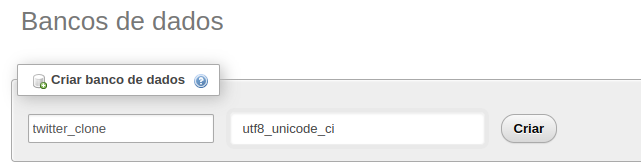
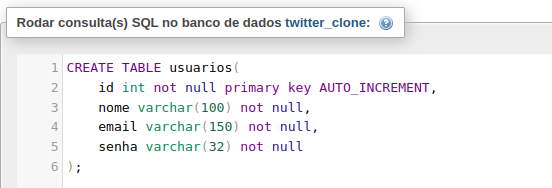
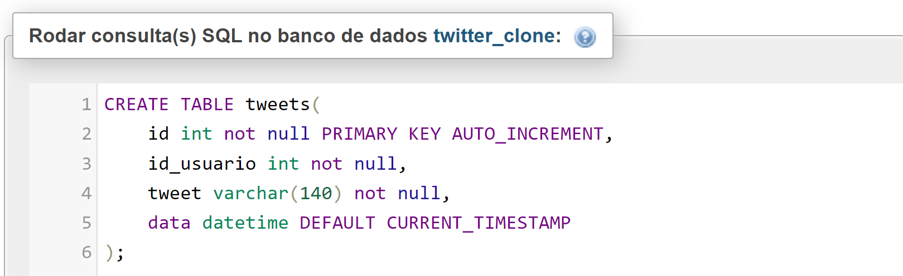
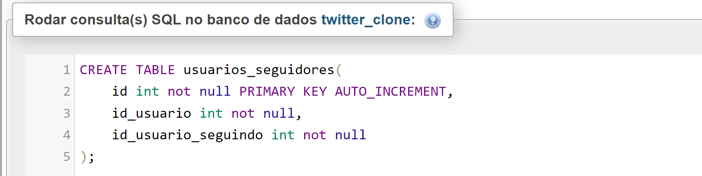
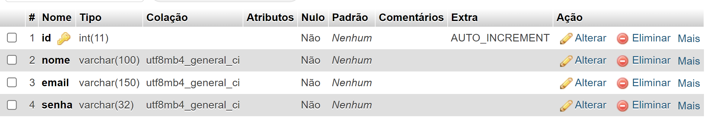
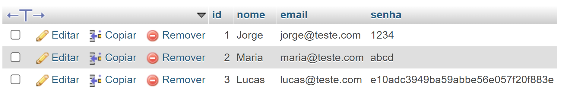
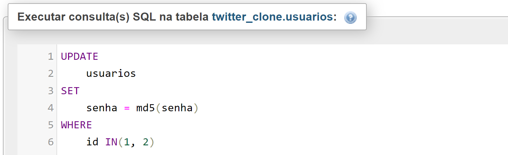
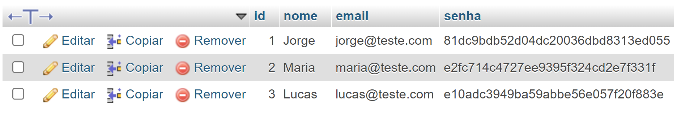
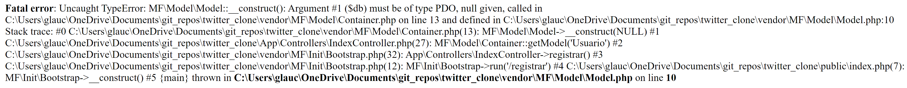

# twitter_clone
PHP | MySQL | MVC Project

# Tools
- [composer](https://getcomposer.org/)
- [bootstrap](https://getbootstrap.com/)
- [jquery](https://jquery.com/)
- [PHP Doc](https://www.php.net/)
- [my mini framework](https://github.com/glaucoSapucaia/MVC_php)
- [icons](https://fontawesome.com/)
- [.htaccess](https://httpd.apache.org/docs/2.2/pt-br/howto/htaccess.html)

# Data Base
  
  
  

## Criptografando senhas
### md-5 | hash de 32 caracteres | varchar(32)
  
  
  

# Erros
## PDO Obj  
   
### Soluções
  - Comente as linhas de Virtual Server (example...) em httpd-ssl file
  - Adicione uma senha ao MySql e PHPAdmin do Xampp | Lampp